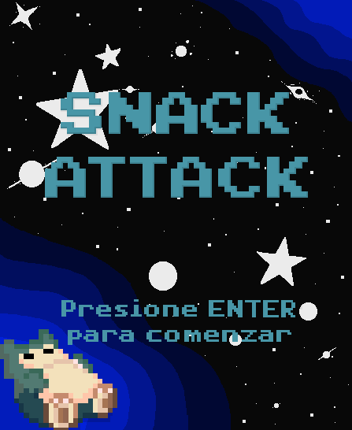
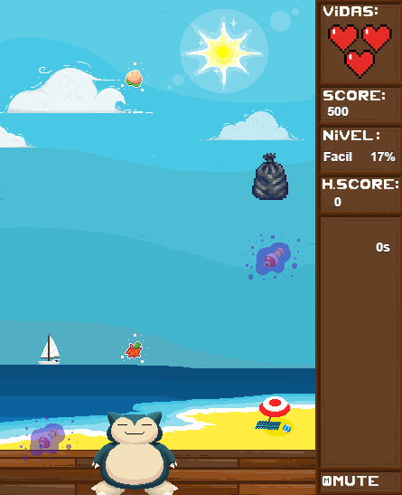
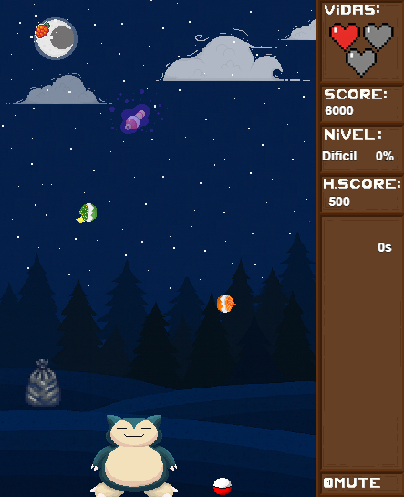
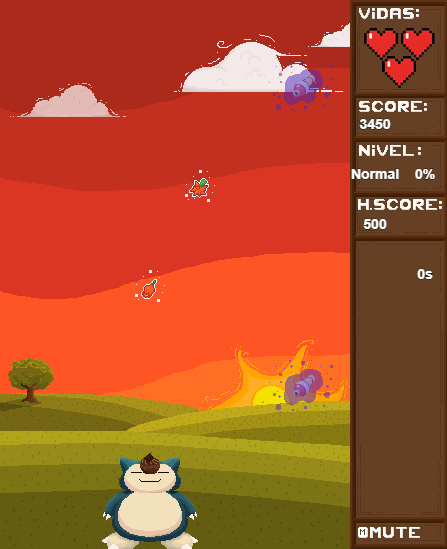
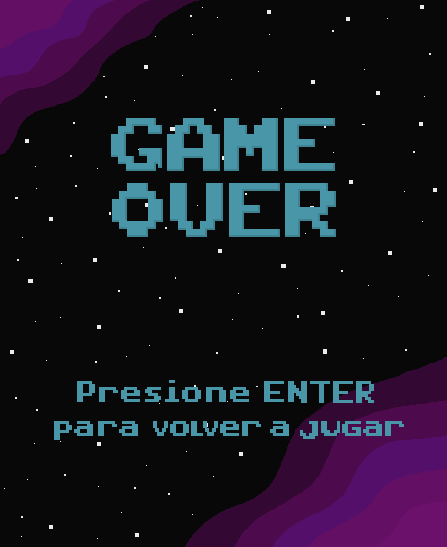

# Snack Attack

## Equipo de desarrollo
- Omar Sosa
- Martin Sarracini
- Santiago Barreto
- Nahuel Lezcano

## Capturas

## BIENVENIDA 
Bienvenido a Snack Attack!
De los creadores del pou, existe la continuación libre de copyright del mejor juego jamás creado.
En este apasionado mundo donde la gula es primordial (tanto que la comida cae del cielo), 
tendrás que comer la mayor cantidad de comida posible. PERO CUIDADO! no todo es color de rosas,
nadie quiere ahogarse por comer una bota olorosa. Por suerte también existen objetos que harán que 
tu festín sea mucho más divertido, podrás tener un estomágo de acero (ser inmortal) e, incluso, recuperar 
vidas. Deseamos que tengas un delicioso y abundante festín, A COMER! 

## INSTRUCCIONES
Bota olorosa: esta bota de origen desconocido y olor putrefacto causa un dolor tan agudo en la barriga de Snorlax,
que lo hace perder una vida.
Manzana podrida: la fruta favorita de todos ha expirado y comerla es sumamente peligroso, tanto que hará perder 
a nuestro panzón amigo.
Bolsa de basura: estos desechos mugrosos caen de tal manera que noquean a Snorlax, haciéndolo perder otra vida.
PokeFlauta: CUIDADO! esta flauta con poderes causará que Snorlax no tenga hambre durante unos segundos.
Pokebola: nuestro queridísimo amigo es tan tierno que gente quiero capturarlo, cada vez que Snorlax choque con una 
pokebola se verá atrapado (e incapaz de moverse y comer) por unos segundos.
PokeBayas: estas curiosas y raras frutas son tan deliciosas que hacen que Snorlax recupere una vida.
Pokelitos: unos extravagantes pastelitos que dan puntos cada vez que son comidos por Snorlax.

## Otros

- Curso/Facultad
- Versión de wollok
- Una vez terminado, no tenemos problemas en que el repositorio sea público / queremos manternerlo privado
